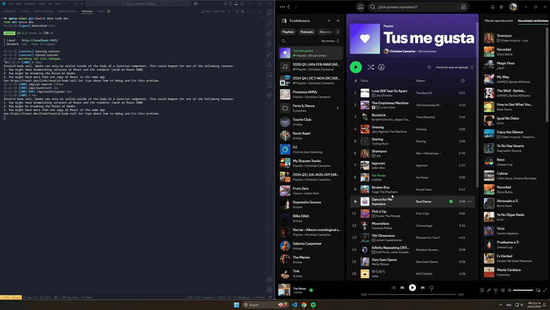
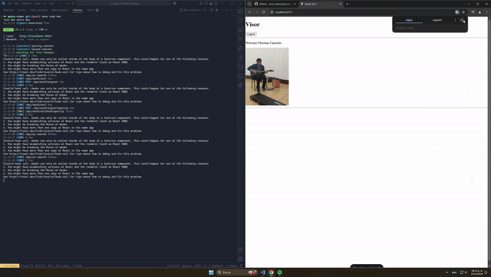

# Spoty Visor

Spoty Visor is an experimental web project that automatically plays YouTube videos for your currently playing Spotify track. Once you’re listening to a song on Spotify, Spoty Visor identifies the track and seamlessly plays a corresponding video from YouTube.




---

## Table of Contents

1. [Features](#features)
2. [Dependencies](#dependencies)
3. [Tech Stack](#tech-stack)
4. [Installation & Setup](#installation--setup)
5. [Usage](#usage)
6. [Learnings](#learnings)
7. [Contributing](#contributing)
8. [License](#license)

---

## Features

- **Autoplay Videos**: Automatically fetches and plays YouTube videos associated with your current Spotify song.
- **Live Sync**: Monitors your Spotify playback to switch videos as your tracks change. **(WIP)**
- **Authentication**: Integrates with Auth.js (via Astro) for user authentication when required.
- **Modern Web Stack**: Built with Astro and React, ensuring fast, modular development.

---

## Dependencies

- [**yt-dlp**](https://github.com/yt-dlp/yt-dlp) – for fetching and downloading YouTube videos
- [**Spotify Web API**](https://developer.spotify.com/documentation/web-api) – to retrieve information about your currently playing track

---

## Tech Stack

- [**Astro**](https://astro.build/) – static site framework
- [**React**](https://react.dev/) – user interface library
- [**Auth.js**](https://authjs.dev/) – authentication library

---

## Installation & Setup

1. **Clone the repository**:

   ```bash
   git clone https://github.com/your-username/spoty-visor.git
   cd spoty-visor
   ```

2. **Install dependencies**:

   ```bash
   npm install
   ```

   or

   ```bash
   yarn install
   ```

   or

   ```bash
   deno install
   ```

3. **Setup Spotify credentials**:

   - Create a [Spotify Developer](https://developer.spotify.com/documentation/web-api/) application and obtain a Client ID and Client Secret.
   - Set up the redirect URI to point to your local or production URL.

4. **Configure environment variables**:

   - Create a `.env` file at the root of your project and add the necessary environment variables (e.g., Spotify Client ID, Client Secret, etc.). For example:
     ```dotenv
     SPOTIFY_CLIENT_ID=your_client_id
     SPOTIFY_CLIENT_SECRET=your_client_secret
     ```
   - Ensure your `.env` file is **not** committed to version control.

5. **Run the development server**:
   ```bash
   npm run dev
   ```
   or
   ```bash
   yarn dev
   ```
   or
   ```bash
   deno task dev
   ```
   - The Astro server should start at [http://localhost:3000](http://localhost:3000) (or whichever port you configured).

---

## Usage

1. **Log In**: If you’ve set up Auth.js, navigate to the home route (e.g., `/`) to authenticate using the configured provider (e.g., Spotify OAuth).
2. **Start Playing Music**: Open Spotify and start playing any song.
3. **Watch Videos**: Head back to Spoty Visor. The app should detect your current track via the Spotify API and begin playing the corresponding video from YouTube automatically. **(WIP)**

---

## Learnings

- How to integrate **Auth.js** with **Astro** for external provider logins, such as Spotify OAuth.
- Managing authenticated API requests to the Spotify Web API.
- Automating video playback by leveraging **yt-dlp** to retrieve relevant video content.

---

## Contributing

Contributions are welcome! If you would like to improve or extend Spoty Visor:

1. Fork the project and clone your fork.
2. Create a new branch: `git checkout -b feature/new-awesome-feature`
3. Make your changes.
4. Commit your updates: `git commit -m 'Add some new feature'`
5. Push to the branch: `git push origin feature/new-awesome-feature`
6. Submit a pull request!

---

## License

This project is licensed under the [MIT License](LICENSE). You are free to use and modify this project for personal or commercial purposes.

---

Enjoy Spoty Visor! If you have any questions, suggestions, or just want to say hi, feel free to open an issue or reach out.
